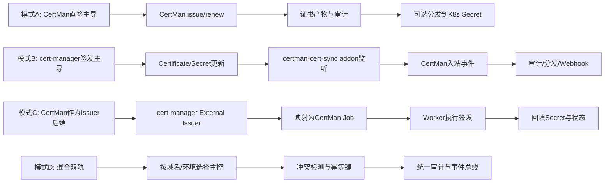
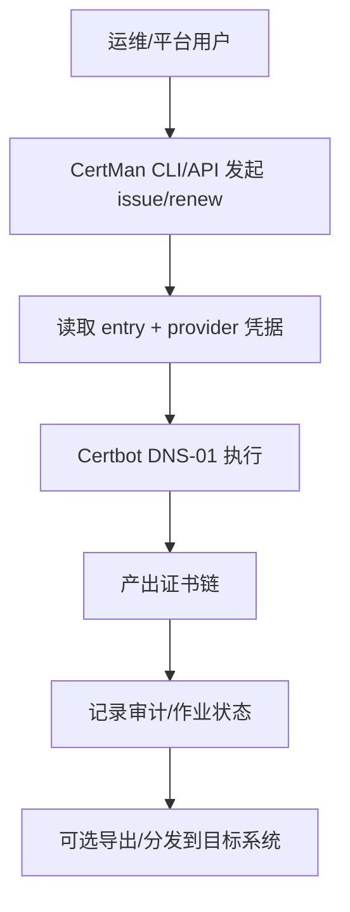
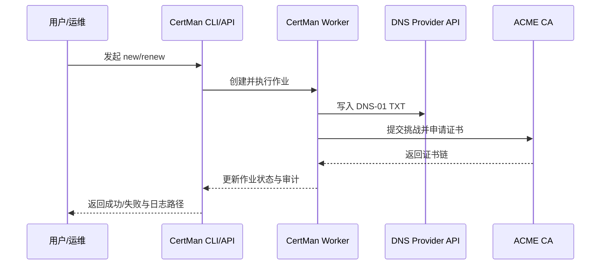
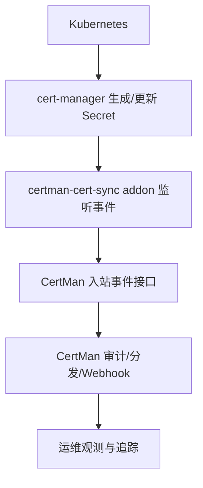
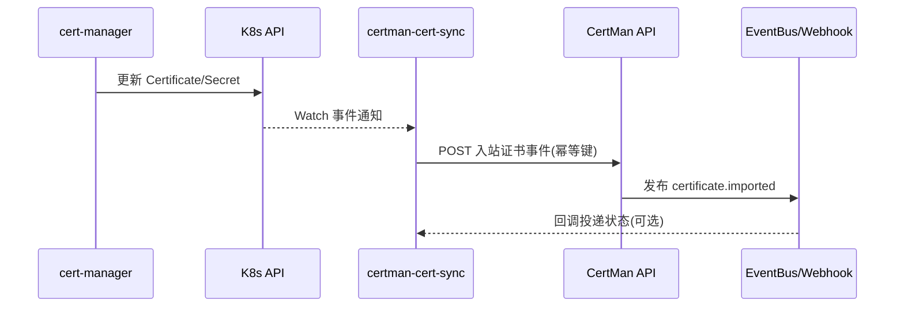
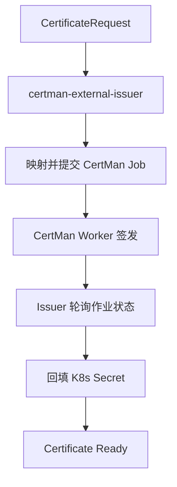
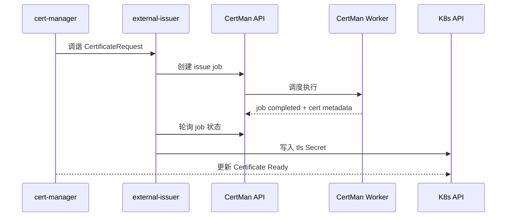
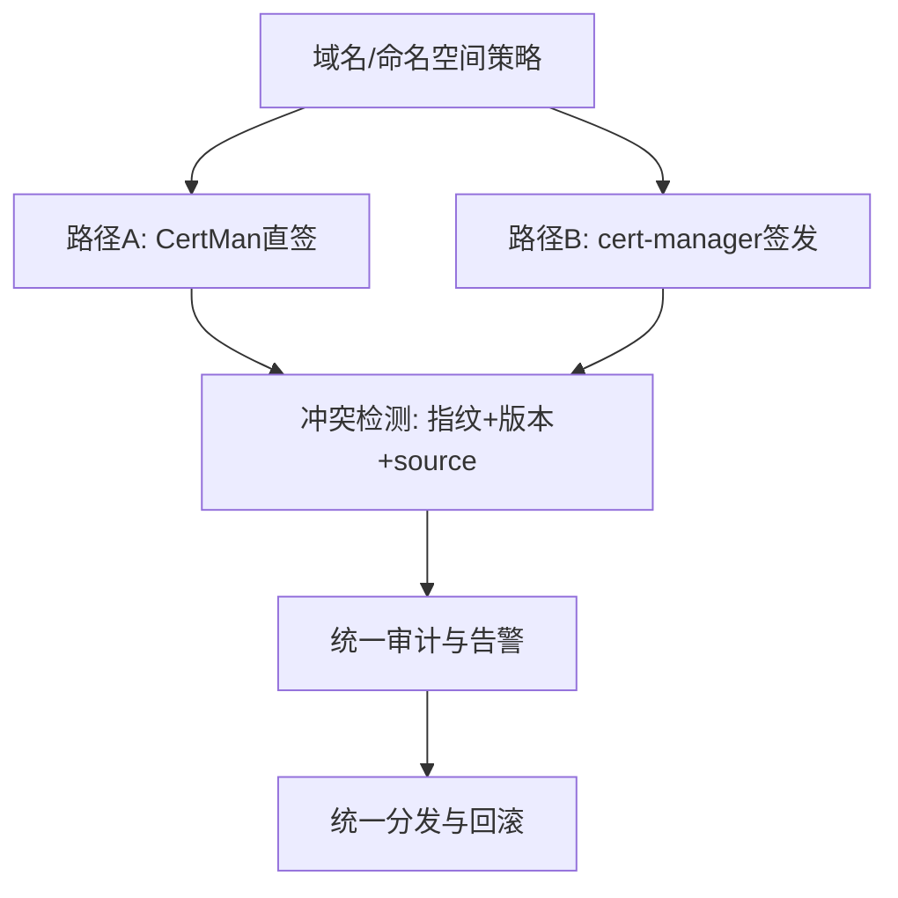
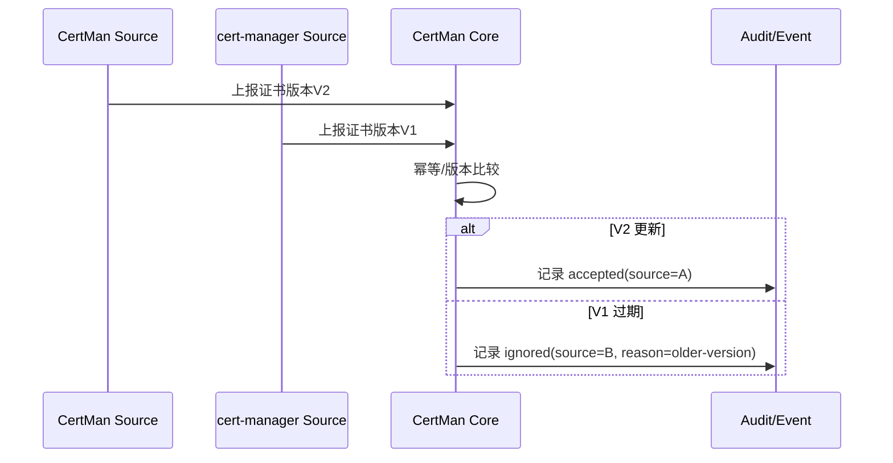

# CertMan 与 cert-manager 协作模式说明（业务流程与时序）

> 日期: 2026-03-27
> 目标: 用统一视角说明两者协作边界、数据流与执行时序，帮助用户快速理解"先落地、再演进"的路径。
>
> **实装状态说明**: 本文档包含设计图与未来规划。**当前仅模式A已完整实现并测试验证**，模式B/C/D 为架构设计文档，代码尚未实现。详见 §7.1。

## 1. 角色与边界

1. CertMan: 证书控制平面，负责任务编排、签发执行、审计、分发。
2. cert-manager: Kubernetes 证书自动化控制器，负责 CRD 驱动的证书生命周期管理。
3. addon/plugin: 两者解耦协作层，避免把 CertMan 主干绑定为单一 K8s 控制器。

## 2. 协作模式总览



## 3. 模式A: CertMan 直签主导（当前短期推荐）

### 3.1 业务流程图



### 3.2 时序图



## 4. 模式B: cert-manager 主导，CertMan 下游同步

### 4.1 业务流程图



### 4.2 时序图



## 5. 模式C: cert-manager 通过 External Issuer 调用 CertMan

### 5.1 业务流程图



### 5.2 时序图



## 6. 模式D: 混合双轨（建议生产演进形态）

### 6.1 业务流程图



### 6.2 时序图（冲突处理）



## 7. 采用建议

1. 短期: 采用模式A，快速交付并稳定真实域名签发/续签。
2. 中期: 引入模式B（只入站、只审计、可幂等重放）作为低风险扩展。
3. 长期: 评估模式C，在稳定映射与 RBAC 策略后再推进。
4. 生产: 通过模式D 将多来源统一到单一审计与分发闭环。

## 7.1 各模式实装状态（2026-03-27）

> **重要**：本文档中的流程图与时序图反映的是**设计意图**，不代表代码已实现。
> 下表为各模式的真实实装状态，避免维护者误判。

| 模式 | 代码实现 | 自动化测试 | 说明 |
|------|----------|------------|------|
| **模式A**: CertMan 直签主导 | ✅ 完整实现 | ✅ 已验证 | `CertService.issue()/renew()` → certbot DNS-01；真实域名直签 + 续签 dry-run 通过 |
| **模式B**: cert-manager 主导 + CertMan 下游同步 | ❌ 未实现 | ❌ 未测试 | 缺少 `POST /api/v1/events/inbound` 路由、`certificate.imported` 事件主题、`certman-cert-sync` addon |
| **模式C**: cert-manager External Issuer 调用 CertMan | ❌ 未实现 | ❌ 未测试 | 缺少 External Issuer CRD 控制器、`external-issue` Job 类型、K8s Secret 回填逻辑 |
| **模式D**: 混合双轨 | ❌ 未实现 | ❌ 未测试 | 依赖模式B + 模式C 先完成，当前为纸面规划 |

### 模式B 最小实现清单（待开发）

1. `certman/api/routes/events.py` — `POST /api/v1/events/inbound` 入站路由
2. `certman/events.py` — 新增 `certificate.imported` 事件主题
3. `certman-cert-sync` addon — 独立进程，监听 K8s `Certificate`/`Secret` 变化并调用入站接口

### 模式C 最小实现清单（待开发）

1. `certman-external-issuer` 控制器 — 实现 cert-manager ExternalIssuer CRD 协议（Go 或 Python）
2. `certman/models/job.py` — 新增 `external-issue` Job 类型
3. Worker 侧 — 完成后回填 K8s `Secret(tls.crt/tls.key/ca.crt)`

## 8. 常见误解 FAQ

### 8.1 模式B同步的是证书内容，还是解析服务商 AK/SK？

结论：模式B默认同步的是证书结果与状态，不是解析服务商 AK/SK。

1. cert-manager 主导签发后，会更新 `Certificate` 与 `Secret(tls.crt/tls.key/ca.crt)`。
1. `certman-cert-sync` 监听这些变化，并把证书事件推给 CertMan 入站接口。
1. CertMan 侧主要做审计、版本比较、事件分发与 webhook 通知。
1. DNS 凭证（AK/SK、API Token）属于签发侧敏感凭据，不建议作为业务同步对象进入 CertMan。

### 8.2 模式B下 CertMan 应保存什么，不应保存什么？

1. 应保存：证书指纹、域名、有效期、来源(source)、版本(version)、关联资源标识。
1. 可选保存：证书正文（按合规要求，可做密文存储或仅保留摘要）。
1. 不应保存：解析服务商主账号凭证、与签发无关的高权限密钥。

## 9. CertMan 跨环境配置兼容层

> 完整架构说明见 [`docs/k8s-service-design.md` §15](k8s-service-design.md)

### 9.1 三环境统一模型

CertMan 在以下三种环境下做到 **零代码改动** 切换。`config.py` 和 `providers.py` 的读取路径在三者中完全一致：

| 项目 | 本地开发（宿主机运行） | Docker Compose | Kubernetes 生产 |
|------|----------------------|----------------|-----------------|
| 非敏感配置（`*.toml`） | `data/conf/*.toml`（文件） | bind mount `./data/conf` | ConfigMap → 挂载 `/data/conf/`（ReadOnly）|
| 敏感凭据（AK/SK、Token） | `data/conf/.env`（文件） | `env_file:` 或 `environment:` | Secret → **`envFrom.secretRef`** → 容器环境变量 |
| 注册令牌（单键） | `data/conf/.env` 或 CLI 参数 | `environment: CERTMAN_NODE_REGISTRATION_TOKEN=...` | Secret → **`secretKeyRef`** 单键注入 |
| CertMan 代码读取方式 | `load_dotenv` + `os.getenv()` | 同左 | **同左**（代码 0 改动）|

### 9.2 兼容性的实现原理

**关键点 1 — `config.py`: `load_dotenv(override=False)`**

```
K8s Secret (envFrom)  ──先注入──▶ 容器环境变量已存在
                                        ↓
load_dotenv(override=False)  ── /data/conf/.env 不覆盖已有环境变量
```

`override=False` 使 K8s Secret 注入的值自动"赢过" `.env` 文件，不需要任何代码适配。

**关键点 2 — `providers.py`: `os.getenv()` 来源透明**

```python
# providers.py（三种环境下调用完全相同）
account = normalize_account_id(entry.account_id)   # strip().replace("-","_").upper()
ak = os.getenv(f"CERTMAN_ALIYUN_{account}_ACCESS_KEY_ID")
```

### 9.3 环境变量命名约定

`account_id` 经 `normalize_account_id()` 处理后构成环境变量名：

| `item_*.toml` 中的 `account_id` | 对应环境变量名 |
|----------------------------------|----------------|
| `my_aliyun` | `CERTMAN_ALIYUN_MY_ALIYUN_ACCESS_KEY_ID` / `_ACCESS_KEY_SECRET` |
| `my-cloudflare` | `CERTMAN_CLOUDFLARE_MY_CLOUDFLARE_API_TOKEN` |
| `prod_aws` | `CERTMAN_AWS_PROD_AWS_ACCESS_KEY_ID` / `_SECRET_ACCESS_KEY` / `_REGION` |

也可在 TOML 中直接用 `${ENV_VAR}` 引用任意环境变量（由 `_resolve_value()` 解引用）：

```toml
[entries.credentials]
access_key_id     = "${MY_CUSTOM_AK}"
access_key_secret = "${MY_CUSTOM_SK}"
```

### 9.4 K8s 推荐配置层次

```
ConfigMap: certman-config
└─ config.toml, item_*.toml（非敏感，可提交 Git）
   ↓ volume 挂载 → /data/conf/（ReadOnly）

Secret: certman-dns-credentials
└─ CERTMAN_ALIYUN_*/CLOUDFLARE_*/AWS_*（AK/SK，不进 Git）
   ↓ envFrom.secretRef → 容器环境变量 → providers.py 读取

Secret: certman-agent-registration
└─ registration-token
   ↓ secretKeyRef → CERTMAN_NODE_REGISTRATION_TOKEN
```

### 9.5 不推荐做法

| 做法 | 原因 |
|------|------|
| 把 AK/SK 明文写入 ConfigMap | ConfigMap 可被普通 RBAC 角色读取 |
| 把凭据硬编码进 `item_*.toml` 并提交 Git | 凭据泄漏风险 |
| K8s 中使用 `load_dotenv(override=True)` | 会覆盖 Secret 注入值，导致优先级反转 |
| 把 AK/SK 作为模式B同步数据传播 | AK/SK 是签发侧凭据，不属于证书结果同步范畴 |

### 9.6 参考文件

- **实验清单**（功能连通性验证）: [`k8s-e2e-test.yaml`](../k8s-e2e-test.yaml)
- **生产级示例清单**（ConfigMap + Secret + envFrom 完整模板）: [`k8s/certman-prod-credentials-example.yaml`](../k8s/certman-prod-credentials-example.yaml)
- **完整架构说明**: [`docs/k8s-service-design.md` §15](k8s-service-design.md)
