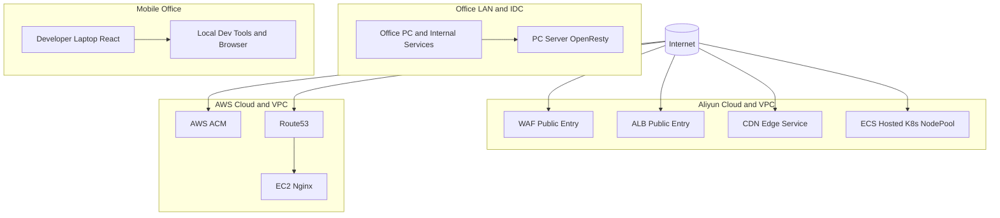
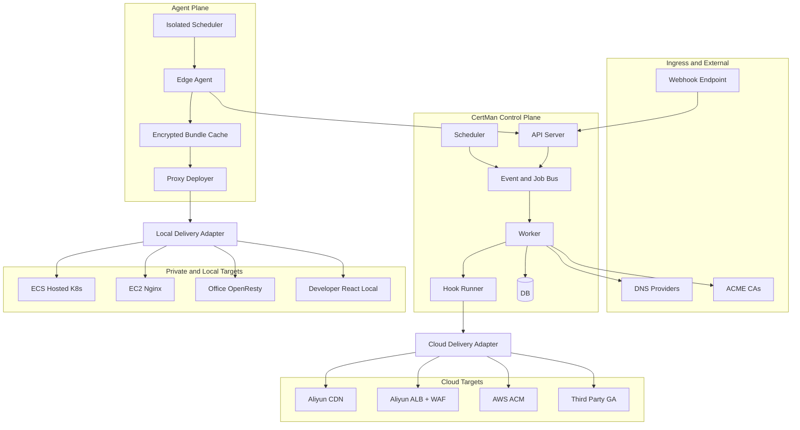
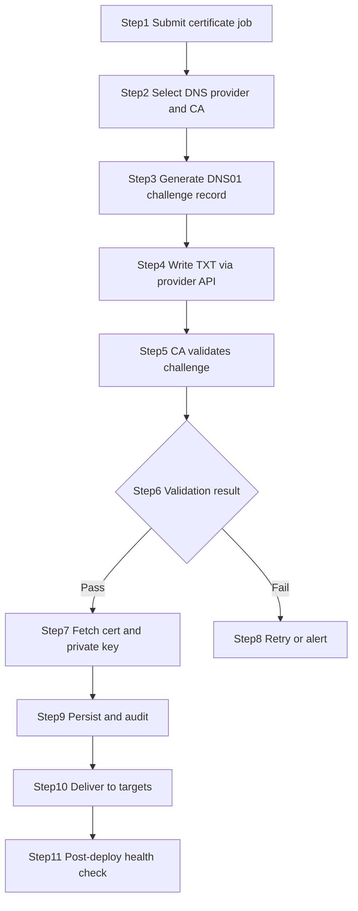
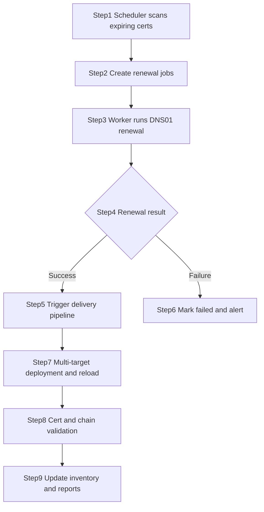
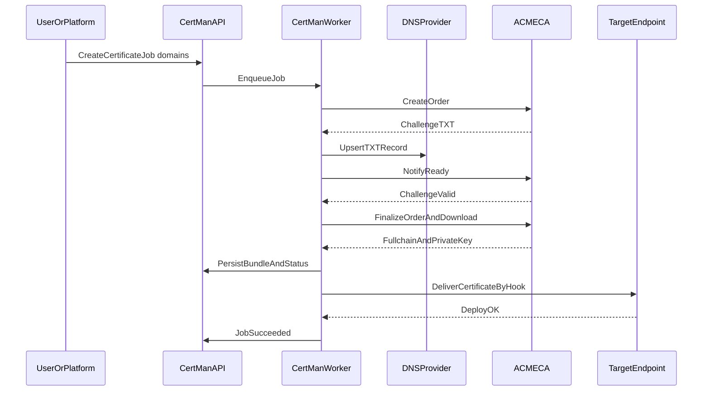
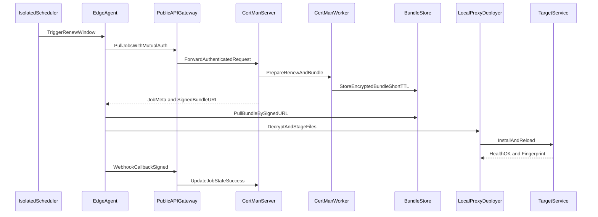

# Complex Hybrid Certificate Governance (CertMan Implementation)

This document describes a realistic multi-cloud and hybrid-network background, then maps it to an implementable CertMan architecture and operational workflow.

## 1. Scenario and Pain Points

Target endpoints include:

- Aliyun CDN
- Aliyun ALB + WAF
- Self-managed Kubernetes on ECS
- AWS ACM
- Nginx on EC2
- Third-party global accelerator provider
- OpenResty on office LAN server
- Local React frontend debugging on mobile office laptop

### 1.1 Shared Requirements

- Every endpoint must use HTTPS certificates
- Certificates must be renewed regularly
- DNS-01 verification is usually centralized at DNS providers (Route53/Aliyun/Cloudflare)
- Issuance is only one step; delivery, reload, rollback, and validation are the hard part

### 1.2 Core Problems

- Single-node tools like certbot/acme.sh solve local issuance, not global orchestration
- Multi-cloud + on-prem + local environments need a unified certificate control plane
- Renewal windows, retries, asset tracking, secret safety, and auditing are easy to fragment

### 1.3 Network Topology (Background Only)



## 2. CertMan Positioning

CertMan acts as a cross-environment certificate control plane:

- Unified integration with ACME CAs (Let's Encrypt / ZeroSSL)
- Unified DNS-01 execution through Route53 / Aliyun / Cloudflare
- Unified job lifecycle (issue, renew, status tracking)
- Unified delivery to cloud, k8s, on-prem, and local targets
- Unified API, CLI, and MCP access for platform and AI integration

## 3. Implementable Target Architecture (with Agent proxy capability)



### 3.1 Agent Mode Design Points

1. Scheduler is decoupled and can run on server side or agent-side isolated networks.
2. No inbound public port is required for private networks; agent can work with outbound pull.
3. Dual channels:

- Control channel: authenticated API for polling assignments and metadata.
- Data channel: short-lived signed URL for encrypted bundle fetch.

1. Bundle encryption: envelope encryption on server and local decrypt on agent.
2. Trigger mode:

- Webhook push only when agent has a public reachable HTTPS endpoint.
- Otherwise use pull polling or scheduler-driven pull.

1. Local triggers: agent can load conf-based internal webhook triggers in its local network.
2. Delivery feedback: callback by webhook or poll-based acknowledgment.
3. Minimized exposure: short TTL URL, one-time token, nonce replay protection.

## 4. End-to-End Process

### 4.1 Initial Issuance Flow



### 4.2 Renewal and Rotation Flow



## 5. Sequence Diagrams

### 5.1 DNS-01 Issuance Sequence



### 5.2 Private Network Delivery Sequence (Agent)



## 6. Current CertMan Capability Mapping

Available now:

- One-shot scheduler: certman-scheduler once
- Loop scheduler: certman-scheduler run --loop
- Agent one-shot and loop: certman-agent --once / certman-agent --loop
- One-shot local cert flow: certman oneshot-issue / oneshot-renew
- Unified API + CLI + MCP surface
- DNS providers: Route53 / Aliyun / Cloudflare

Implemented Agent-Server handshake and execution chain:

1. POST /api/v1/nodes/register
2. POST /api/v1/node-agent/poll
3. GET /api/v1/node-agent/bundles/{job_id}
4. POST /api/v1/node-agent/result

## 7. Phased Implementation Plan

### Phase A: Domain and policy modeling

1. Inventory all domains and certificate boundaries.
2. Map authoritative DNS validation paths by domain group.
3. Define renewal window, retries, and alerting policy.

### Phase B: Control plane rollout

1. Deploy API, worker, scheduler.
2. Store provider credentials securely.
3. Validate issuance/renewal with test domains first.

### Phase C: Endpoint adaptation and delivery

1. Cloud services through hook adapters.
2. Host services through file deploy and reload commands.
3. K8s through secret update and rolling reload.
4. Local React debug with one-shot output.
5. Private segments through agent pull and local deployment.

## 8. Quick Start

### 8.1 Local one-shot

```bash
certman oneshot-issue \
  -d dev.example.com \
  -sp route53 \
  --ak "$AWS_ACCESS_KEY_ID" \
  --sk "$AWS_SECRET_ACCESS_KEY" \
  -o ./data/output/dev
```

### 8.2 Platform-triggered one-shot scan

```bash
certman-scheduler once
```

### 8.3 Continuous renewal loop

```bash
certman-scheduler run --loop
```

## 9. Security and Governance Notes

- Least-privilege DNS credentials
- Minimal key exposure on disk
- TLS + signature verification for delivery paths
- Nonce replay protection and auditing
- Low-traffic rotation windows and rollback strategy

## 10. Target Mapping Table

| Target Type | Recommended Delivery | Activation | Validation |
| --- | --- | --- | --- |
| Aliyun CDN | Cloud API hook | Publish cert via API | TLS handshake and chain check |
| ALB/WAF | Cloud API hook | Bind or swap cert | Entry TLS check |
| ECS K8s | Secret/volume delivery | Reload or rolling update | Ingress cert verification |
| AWS ACM | AWS API hook | Attach listener cert | ALB/NLB cert check |
| EC2 Nginx | Agent file deploy + command | nginx reload | openssl s_client |
| Third-party GA | Provider API hook | Publish in platform | Edge domain TLS check |
| Office OpenResty | Agent file deploy + command | openresty reload | Internal TLS check |
| Local React debug | one-shot local output | restart dev server | Browser chain check |

## 11. Implemented Status and Next Steps

Implemented:

1. Agent loop mode is now available.
2. Agent execution chain is complete: poll -> bundle -> execute -> result.
3. Bundle endpoint is implemented with signature and nonce replay protection.
4. NodeExecutor supports local file delivery and hooks.

Next steps:

1. Add explicit subscribe and heartbeat APIs for push-plus-pull hybrid mode.
2. Add delivery target type and network-scope fields to job model.
3. Add short-lived bundle token and finer-grained permissions.
4. Add scheduler target-scope scanning.
5. Add more adapters for nginx/openresty/k8s ingress specifics.

## 12. Conclusion

In this hybrid topology, the hard problem is not issuing a single certificate, but turning certificate lifecycle into a schedulable, observable, and auditable system capability.

CertMan provides that path through unified validation entry, unified orchestration, and unified delivery adapters.
