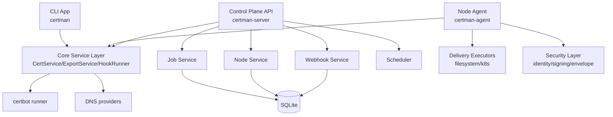
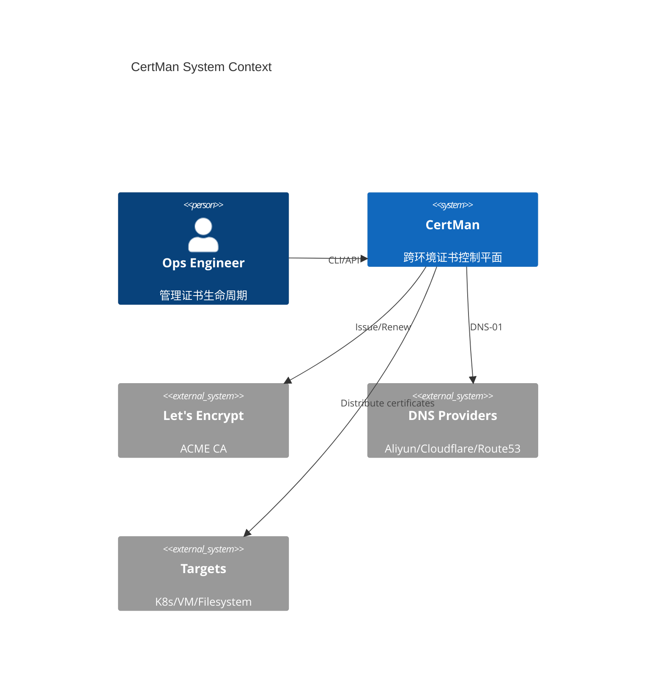
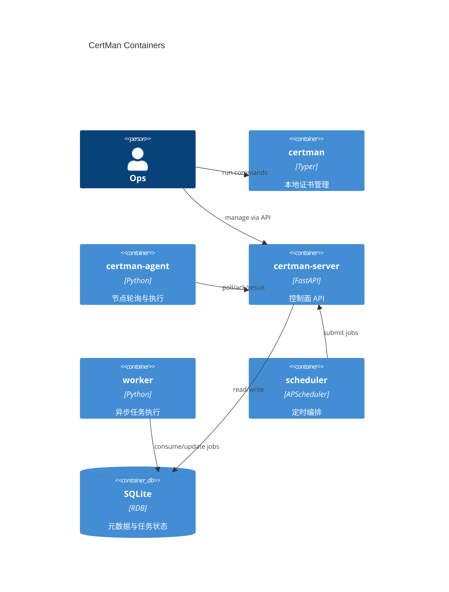
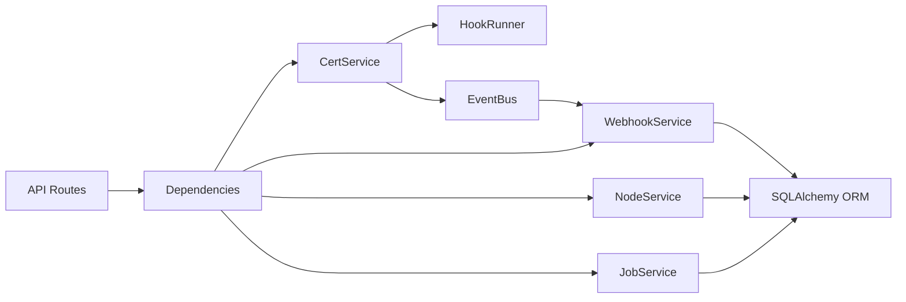
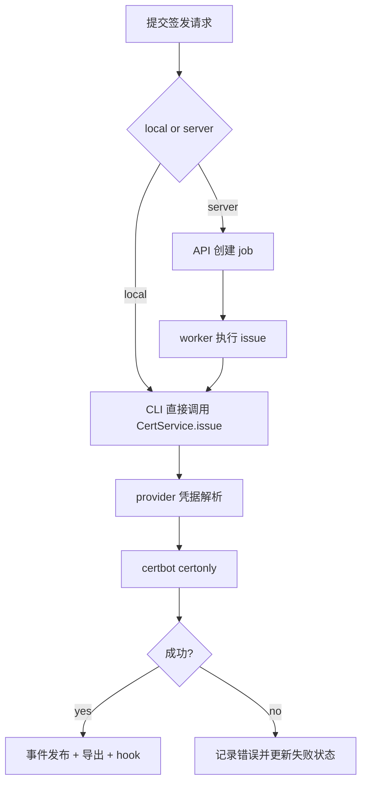
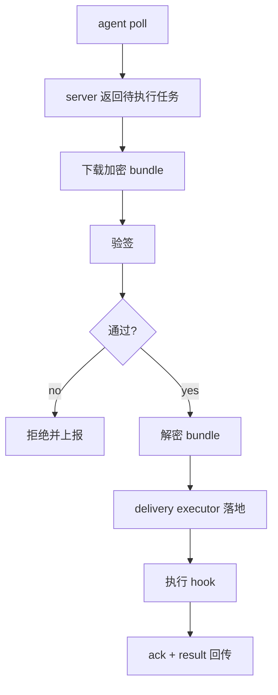
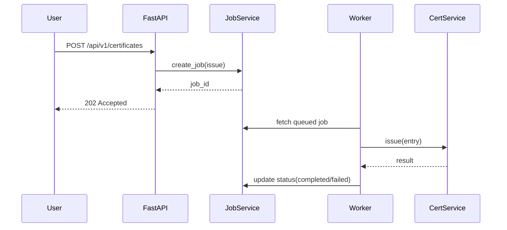
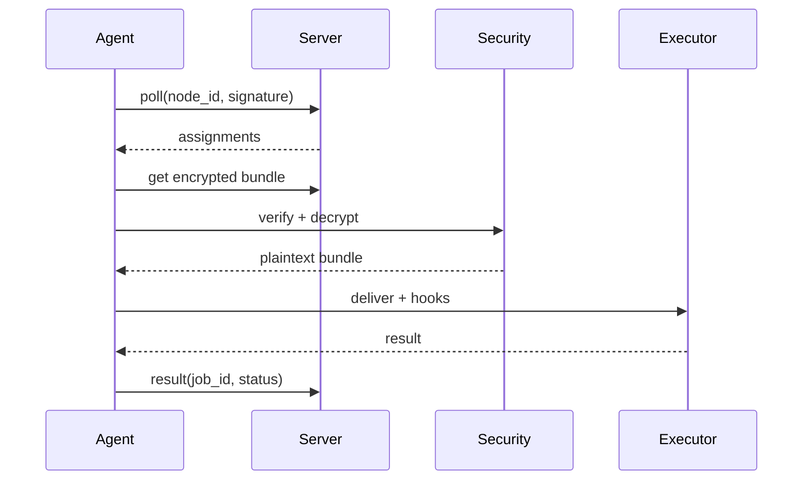
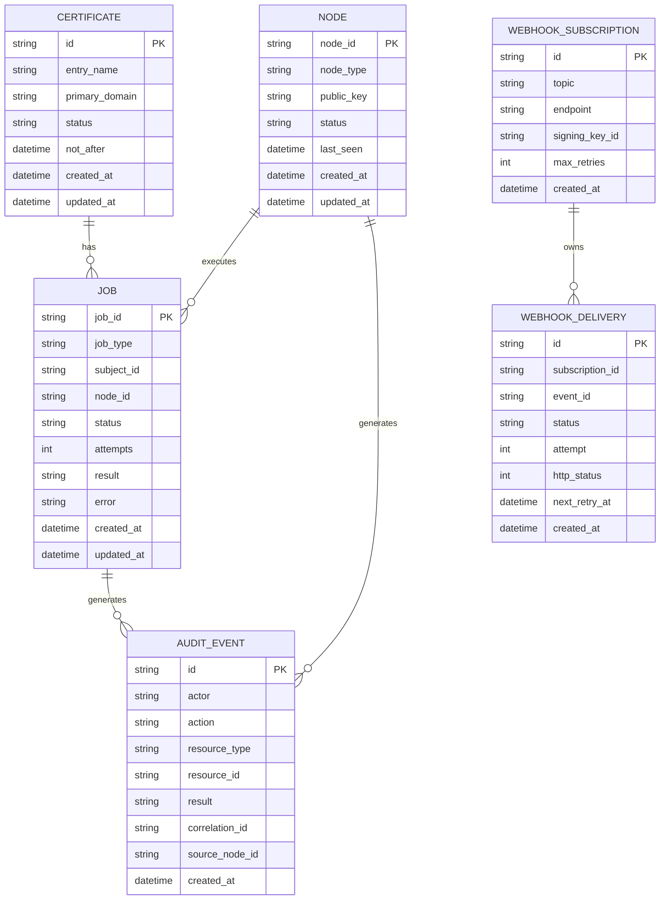

# CertMan 控制平面架构与详细设计

> 版本: 1.0
> 日期: 2026-03-26

## 1. 组织架构与职责分层



## 2. C4 图

### 2.1 Context



### 2.2 Container



### 2.3 Component (Server)



> **Note:** HookRunner（Phase 1）是同步 shell 命令执行器，直接由 CertService 调用，不依赖 EventBus。
> EventBus（Phase 5）是进程内事件发布机制，驱动 Webhook 投递，与 HookRunner 并列而非包含关系。

## 3. 业务流程图

### 3.1 证书签发



### 3.2 Agent 拉取执行



## 4. 时序图

### 4.1 API 提交任务与执行



### 4.2 Agent 执行任务



## 5. ER 关系图



## 6. 关键设计决策 (ADR)

### ADR-01: 共用执行内核

- 决策: CLI/Agent/Server 共用 CertService 与导出/Hook 能力。
- 收益: 避免逻辑分叉，降低回归风险。

### ADR-02: 持久化选型

- 决策: 初期使用 SQLite + SQLAlchemy。
- 收益: 部署简单，后续可迁移 PostgreSQL。

**ADR-02 补充: 持久化访问边界**

- 迁移策略: SQLAlchemy 方言切换 + Alembic schema migration。
- 不引入重型 Repository Pattern / 抽象基类 / DI 注入。
- 采用模块级函数集作为轻量 Store 边界:
  - `certman/db/job_store.py` — `create_job(session, ...)` / `get_job(session, id)` / `update_status(session, id, status)`
  - `certman/db/audit_store.py` — `write_event(session, ...)` / `query_events(session, filters)`
  - `certman/db/node_store.py` — `register_node(session, ...)` / `get_node(session, id)` / `update_last_seen(session, id)`
- Store 函数接收 `Session` 作为参数，统一返回 ORM 实体；Pydantic/领域模型转换放在 service 层完成。
- Service 层通过 import 调用 Store 函数，不做接口继承。

### ADR-03: 安全链路

- 决策: Ed25519 签名 + X25519/AES-GCM 信封加密。
- 收益: 节点可验证消息真实性并本地解密证书内容。

### 6.5 安全最小基线（Phase 2 开发前置条件）

以下设计约束在进入 Phase 2 编码前必须冻结，Phase 4 实现。不采用 shared secret 过渡方案。

1. **节点注册与信任建立**
   - Agent 首次连接时提交 Ed25519 公鑰。
   - Server 侧管理员确认（approve）后节点进入 active 状态。
   - 未 approved 节点的 poll 请求返回 403。

2. **签名字段与验签边界**
   - Agent → Server: 对 `{node_id, timestamp, nonce, payload_hash}` 做 Ed25519 签名。
   - Server → Agent: 对 bundle 做 Ed25519 签名，Agent 用 server 公鑰验签。

3. **bundle 下载授权**
   - Agent 仅能下载 `node_id` 匹配的 bundle。
   - Server 在 bundle URL 中嵌入短时效 token（或使用签名请求验证）。

4. **失败事件寡计**
   - 签名验证失败、解密失败、未授权 poll 均写入 AUDIT_EVENT。

### 6.8 错误处理策略

定义业务异常基类与子类:

- `CertManError` — 基类
  - `EntryNotFoundError` — 条目不存在
  - `CertbotError` — certbot 执行失败
  - `SecurityError` — 签名/加密/认证失败
  - `JobStateError` — 非法状态转换
  - `ConfigurationError` — 配置校验失败

各入口层的错误表示:

| 入口 | 错误处理 |
|---|---|
| CLI | catch → exit code + 人类可读 stderr |
| API | FastAPI exception_handler → HTTP 状态码 + JSON envelope |
| Agent | catch → result 回执中的 error 字段 |

## 7. API 分层与契约

- Health: `/health`
- Certificates: `/api/v1/certificates*`
- Jobs: `/api/v1/jobs*`
- Node Agent: `/api/v1/node-agent/*`
- Webhooks: `/api/v1/webhooks/*`

### 7.5 Server 模式配置要求

`_validate_run_mode` 应增加 server 模式校验（Phase 0 实施）:

1. `server.db_path`（或 `database.url`）存在且可写入
2. `server.listen_host` + `server.listen_port` 配置存在
3. `server.signing_key_path` 存在（Ed25519 私鑰，用于签名 Agent 响应）

配置边界应拆分而非复用同一对象:

- 保留 `control_plane.endpoint` 仅用于 `agent` 模式
- 新增独立 `server`（或 `api` + `database`）配置块承载监听地址、数据库路径、签名私鑰
- `_validate_run_mode` 分别校验 agent/server 所需字段，避免把 server 运行配置塞入 `ControlPlaneConfig`

长任务统一语义：

```json
{
  "job_id": "job_20260326_001",
  "status": "queued",
  "status_url": "/api/v1/jobs/job_20260326_001"
}
```

## 8. 安全设计要点

- 节点身份：每节点独立密钥。
- 消息字段：`message_id/node_id/nonce/issued_at/expires_at/payload_hash/signature`。
- 重放防护：nonce 去重 + 过期时间校验。
- 内容机密性：bundle 密文传输，仅目标节点可解。

## 9. 测试设计

- 单元测试：services/security/delivery 模块。
- 集成测试：API + DB + Worker。
- 端到端最小闭环：server + agent + filesystem delivery。
- 覆盖率目标：>= 80%。
