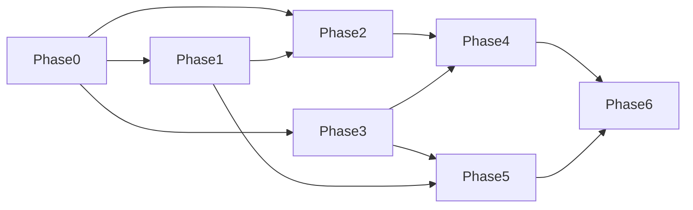

# CertMan 控制平面实施进度文档

> 版本: 1.0
> 日期: 2026-03-26
> 用途: 后续执行与周报跟踪

## 1. 总体里程碑

| 里程碑 | 范围 | 目标状态 |
|---|---|---|
| M1 | Phase 0-1 | 统一内核与导出/hook 服务化完成 |
| M2 | Phase 2-3 | Agent 与 Control Plane API 打通 |
| M3 | Phase 4-5 | 安全链路 + 调度 + webhook 完成 |
| M4 | Phase 6 | 文档部署与验收完成 |

## 2. Phase 看板

| Phase | 工作包 | 状态 | 负责人 | 预计 |
|---|---|---|---|---|
| Phase 0 | 配置与模型修补、DB 基础设施 | Todo | Dev | 2-3d |
| Phase 1 | ExportService + HookRunner | Todo | Dev | 1-2d |
| Phase 2 | Agent + Executor + Delivery | Todo | Dev | 2-3d |
| Phase 3 | FastAPI + JobService + Worker | Todo | Dev | 3-4d |
| Phase 4 | Identity + Signing + Envelope | Todo | Dev | 2-3d |
| Phase 5 | Scheduler + Webhook + EventBus | Todo | Dev | 2-3d |
| Phase 6 | README/Compose/Docker 验收 | Todo | Dev | 1-2d |

## 3. 依赖关系



## 4. 任务分解与检查项

### Phase 0

- [ ] 0.1 `_entry_domains` 去重并统一位置
- [ ] 0.2 强化 `CertificateRecord/JobRecord/NodeIdentityRecord`
- [ ] 0.3 引入 `CheckResult` 类型化返回
- [ ] 0.4 增加 FastAPI/httpx/cryptography/SQLAlchemy 依赖
- [ ] 0.5 创建 `certman/db/*` 与 `tests/test_db.py`

验证命令：

```bash
pytest tests/test_models.py tests/test_config_modes.py tests/test_cert_service.py tests/test_cli_commands.py -q
```

### Phase 1

- [ ] 1.1 创建 `certman/services/export_service.py`
- [ ] 1.2 创建 `certman/hooks/runner.py`
- [ ] 1.3 修改 CLI export 路由到 ExportService

验证命令：

```bash
pytest tests/test_export_service.py tests/test_hook_runner.py -q
```

### Phase 2

- [ ] 2.1 创建 `certman/node_agent/agent.py`
- [ ] 2.2 创建 `certman/node_agent/poller.py`
- [ ] 2.3 创建 `certman/node_agent/executor.py`
- [ ] 2.4 创建 `certman/delivery/filesystem.py`
- [ ] 2.5 创建 `certman/delivery/k8s.py` (stub)

验证命令：

```bash
pytest tests/test_agent_mode.py tests/test_node_executor.py -q
uv run certman-agent --help
```

### Phase 3

- [ ] 3.1 创建 `certman/api/app.py` + health route
- [ ] 3.2 创建 `certman/services/job_service.py`
- [ ] 3.3 创建 `certman/api/routes/jobs.py`
- [ ] 3.4 创建 node-agent API routes
- [ ] 3.5 创建 `certman/server.py` + `certman/worker.py`

验证命令：

```bash
pytest tests/test_api_health.py tests/test_job_service.py -q
uv run certman-server --help
```

### Phase 4

- [ ] 4.1 创建 `security/identity.py`
- [ ] 4.2 创建 `security/signing.py`
- [ ] 4.3 创建 `security/envelope.py`
- [ ] 4.4 集成到 node-agent poll/bundle/result 链路

验证命令：

```bash
pytest tests/test_signing.py tests/test_envelope.py -q
```

### Phase 5

- [ ] 5.1 创建 `scheduler/jobs.py`
- [ ] 5.2 创建 `services/webhook_service.py`
- [ ] 5.3 创建 `api/routes/webhooks.py`
- [ ] 5.4 创建 `events/bus.py`

验证命令：

```bash
pytest tests/test_scheduler_jobs.py tests/test_webhook_service.py -q
```

### Phase 6

- [ ] 6.1 更新 `Dockerfile` 三入口
- [ ] 6.2 更新 `docker-compose.yml` server/agent 服务
- [ ] 6.3 更新 README 与 docs 导航
- [ ] 6.4 全量回归与覆盖率验收

验证命令：

```bash
uv run certman --help
uv run certman-agent --help
uv run certman-server --help
pytest --tb=short
pytest --cov=certman --cov-report=term-missing
```

## 5. 风险清单

| 风险 | 影响 | 缓解 |
|---|---|---|
| certbot 在并发执行时冲突 | 中 | worker 限制并发、串行证书任务 |
| 安全模型实现复杂 | 高 | 先单元测试 signing/envelope 再集成 |
| API 与 CLI 行为偏差 | 中 | 保持核心服务复用，不复制逻辑 |
| 测试数量快速增长导致 CI 变慢 | 低 | 分层测试并按模块执行 |

## 6. 周报模板

```markdown
## 周报 (YYYY-MM-DD)
- 完成: 
- 在做: 
- 阻塞: 
- 测试结果: 
- 下周计划: 
```

## 7. 评审与签署

- 架构评审: Pending
- 安全评审: Pending
- 测试策略评审: Pending
- 上线评审: Pending
