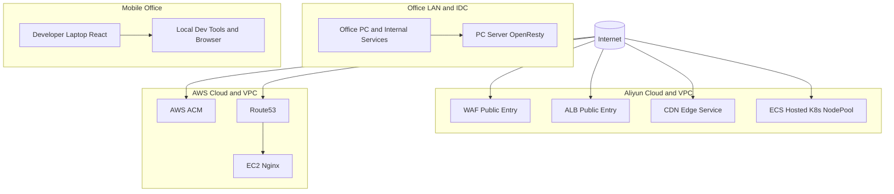
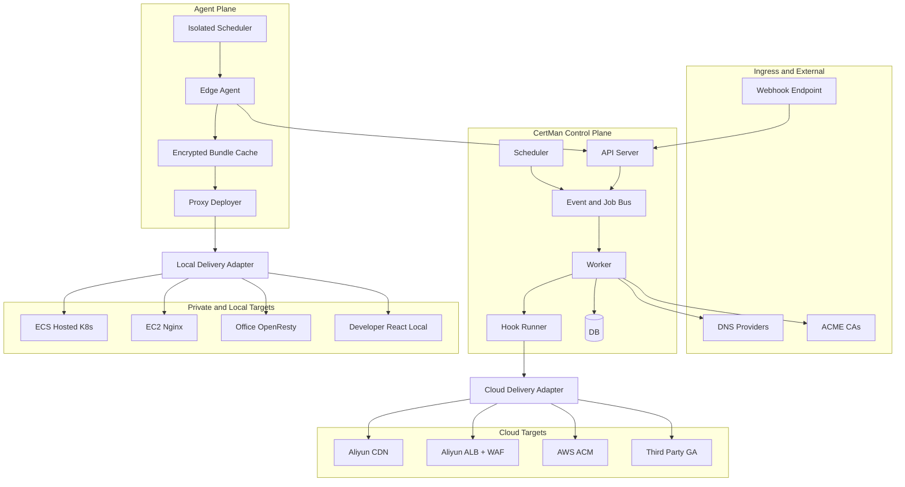
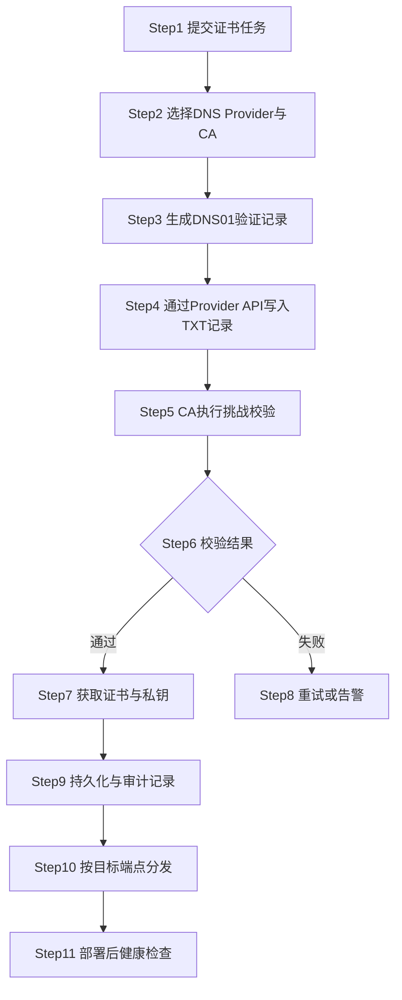
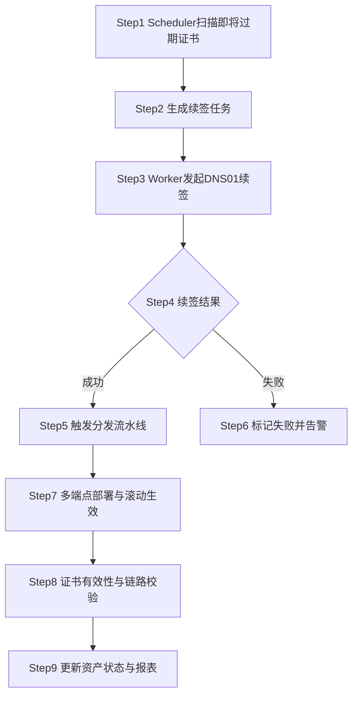
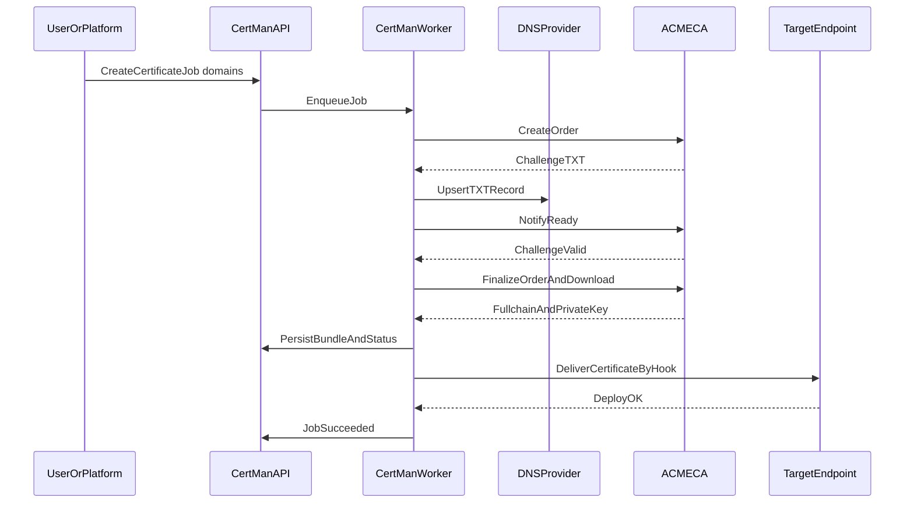
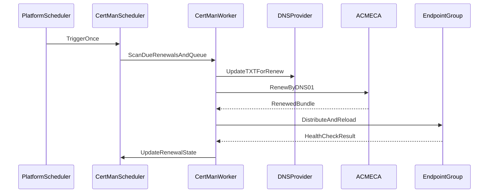
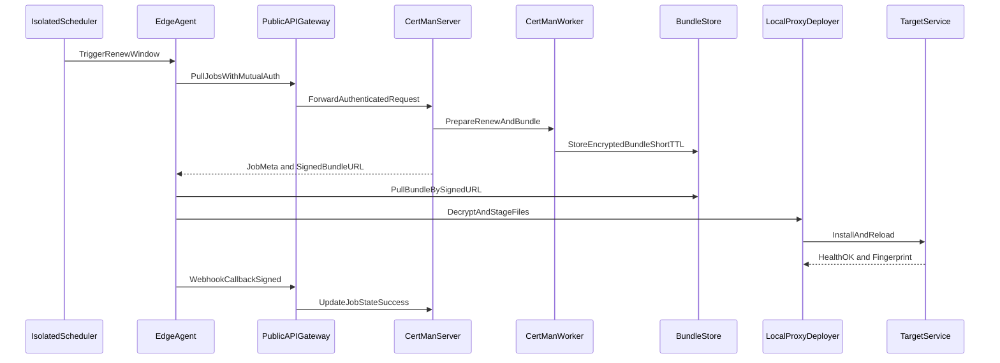

# 复杂混合网络证书治理方案（CertMan 实施版）

本文针对一个相对复杂、真实可见的企业网络拓扑，给出基于 CertMan 的可实施方案，覆盖申请、续签、分发、校验与运维闭环，帮助快速上手。

## 1. 场景与痛点（含网络拓扑分区）

目标环境（端点）包括：

- 阿里云 CDN
- 阿里云 ALB + WAF
- 托管在 ECS 上的自建 Kubernetes 集群
- AWS ACM
- 托管在 EC2 上的 Nginx
- 第三方 GA 服务商（全局加速）
- 本地办公网络 PC Server 上的 OpenResty
- 移动办公笔记本上的本机 React 前端调试

### 1.1 共同诉求

- 全部端点需要 HTTPS 证书
- 证书需要周期性更新
- DNS 验证入口通常是域名解析服务商（Route53/Aliyun/Cloudflare）
- 证书申请只是第一步，后续分发、部署、回滚、校验才是难点

### 1.2 核心问题

- 单点工具（如 certbot/acme.sh）更像"发证执行器"，天然不负责全局编排
- 多云 + 线下 + 本机端点之间，缺少统一证书生命周期控制面
- 续签窗口、失败重试、资产追踪、凭据安全、审计留痕容易分散失控

### 1.3 网络拓扑（需求背景，仅描述现网）



## 2. CertMan 在该场景下的定位

CertMan 的角色是"跨环境证书控制平面"：

- 统一对接 ACME CA（Let's Encrypt / ZeroSSL）
- 统一对接 DNS Provider（Route53 / Aliyun / Cloudflare）用于 DNS-01
- 统一管理证书任务（签发、续签、状态追踪）
- 统一分发到多类端点（云服务、K8s、本地、开发机）
- 统一暴露 API/CLI/MCP 入口，便于平台或 AI 集成

## 3. 可实施目标架构（含 Agent 代理能力）



说明：

- CertMan 负责"申请与编排"，并通过 Hook/Delivery 完成"端点分发"。
- 解析权威入口集中在 DNS Provider，避免在业务端点重复做验证逻辑。
- 新增 Agent 面后，内网端点可通过"出站拉取 + 订阅回调"完成安全分发，不需要开放内网入站端口。

### 3.1 Agent 模式设计要点

1. 调度解耦：Scheduler 可独立部署在 server 侧或 agent/proxy 侧。
2. 无公网入站：内网节点只做出站拉取（poll or subscribe-over-https）。
3. 双通道：
    - 控制通道：agent 通过鉴权 API 拉任务/取 bundle 元数据。
    - 数据通道：agent 通过短时签名 URL 拉取加密证书包。
4. 证书包加密：服务端使用信封加密；agent 使用本地密钥解封。
5. 触发模式：
    - 具备公网可达 HTTP/S 端点时，可使用 webhook push 触发。
    - 无公网端点时，使用 pull 轮询或 scheduler 定时指令 pull。
6. 本地触发：agent 可通过自身 conf 配置，在所在网络内部启用 webhook 触发器（仅内网可达）并映射到本地处理流程。
7. 回调闭环：部署完成后回传状态与证书指纹（可走 webhook callback 或 poll ack）。
8. 最小暴露：bundle URL 短 TTL、一次性 token、重放保护 nonce。

## 4. 端到端处理流程

### 4.1 证书签发流程（首次）



### 4.2 续签与轮转流程（周期）



## 5. 时序图（关键交互）

### 5.1 DNS-01 签发时序



### 5.2 周期续签时序（平台定时触发）



### 5.3 无公网内网端点分发时序（Agent）



## 6. 对应到 CertMan 当前能力

当前可直接使用：

- Scheduler 一次性触发：`certman-scheduler once`
- Scheduler 常驻轮询：`certman-scheduler run --loop`
- Agent 一次模式与守护轮询模式：`certman-agent --once` / `certman-agent --loop`
- 本地阻塞 one-shot：
  - `certman oneshot-issue ...`
  - `certman oneshot-renew ...`
- 控制面 API + CLI + MCP 统一入口
- DNS Provider: Route53 / Aliyun / Cloudflare

Agent 与 Server 当前对接链路（已实现）：

1. `POST /api/v1/nodes/register`：节点注册（一次性 token + 公钥）。
2. `POST /api/v1/node-agent/poll`：签名轮询拉取任务。
3. `GET /api/v1/node-agent/bundles/{job_id}`：签名下载证书包。
4. `POST /api/v1/node-agent/result`：签名回传执行结果。

推荐能力分层：

- 申请/续签：由 CertMan Worker 统一执行
- 分发部署：优先用 Hook Runner 做端点适配
- 平台集成：外部定时系统调用 Scheduler once

## 7. 复杂场景实施流程（分阶段）

### 阶段A：域名与证书策略建模

1. 盘点所有域名与子域名，按业务域划分证书边界。
2. 统一选择验证入口 DNS Provider（按域分组即可，不强制单厂商）。
3. 定义证书策略：有效期、续签窗口、失败重试次数、告警阈值。

### 阶段B：控制面上线

1. 部署 API/Worker/Scheduler。
2. 将 Provider 凭据纳入安全存储（避免明文散落在脚本和主机）。
3. 先在测试域名验证签发与续签闭环。

### 阶段C：端点适配与分发

1. 云端托管服务（CDN/ALB/WAF/ACM/GA）通过 Hook 调用对应厂商 API 完成证书更新。
2. 主机类服务（EC2 Nginx、Office OpenResty）走文件投递 + 热重载命令。
3. K8s 端点优先对接 Secret 更新路径，再触发业务工作负载滚动或 reload。
4. 本机 React 调试环境使用 one-shot 命令快速签发并输出到本地目录。
5. 无公网内网端点通过 Agent 模式拉取加密 bundle 并本地部署。

### 阶段D：自动化与运营

1. 日常使用 `run --loop`，平台补偿触发使用 `once`。
2. 持续校验证书到期、链完整性、端口服务证书一致性。
3. 建立失败分级告警与回滚策略。

### 阶段E：Agent 能力增强（建议）

1. 为每个网络分区部署独立 Agent 节点。
2. 将 `scheduler once` 下沉到分区节点，结合平台定时触发。
3. 引入订阅式 webhook 回调，统一记录部署结果、证书指纹、失败原因。
4. 对公网 API Gateway 启用 mTLS 或签名鉴权 + IP allowlist。

## 8. 快速上手示例（最小闭环）

### 8.1 本机 one-shot（适合开发机/临时端点）

```bash
certman oneshot-issue \
  -d dev.example.com \
  -sp route53 \
  --ak "$AWS_ACCESS_KEY_ID" \
  --sk "$AWS_SECRET_ACCESS_KEY" \
  -o ./data/output/dev
```

### 8.2 平台定时触发一次扫描（适合统一调度）

```bash
certman-scheduler once
```

### 8.3 常驻自动续签（适合生产）

```bash
certman-scheduler run --loop
```

## 9. 安全与治理建议

### 9.1 安全基线（默认开启）

- **Bearer Token 鉴权**（ctl 通道）：所有 `certman-ctl` 远程请求须携带共享密钥 Token，防止未授权访问。
- **Ed25519 签名 + Nonce 防重放**（agent 通道）：每次 agent 请求都需要 Ed25519 签名覆盖 `node_id/timestamp/nonce/payload`，nonce 在服务端 TTL 1h 内保持唯一，防御重放攻击。
- **凭据最小权限**：DNS 操作仅授予 TXT 记录所需权限。
- **私钥保护**：落盘目录最小权限，避免共享存储裸露。
- **防重放与审计**：任务请求签名、nonce、事件留痕。
- **变更窗口**：证书轮转尽量在低峰期，支持灰度发布与快速回滚。

### 9.2 可选：bundle 内容加密（bundle_encryption = "encrypt"）

默认模式下，agent 下载的证书包（bundle）以明文 JSON 传输，完整性由 TLS + 签名保证。对于需要更高保密等级的场景，可开启 **X25519 ECIES 信封加密**：

| 安全等级 | 配置 | 保护效果 | 额外开销 |
| --- | --- | --- | --- |
| 默认（`none`） | `bundle_encryption = "none"` | TLS 传输保护 + Ed25519 请求认证 | 无 |
| 信封加密（`encrypt`） | `bundle_encryption = "encrypt"` | + X25519 ECIES 内容加密（前向保密） | ≈1–5 ms/次，负载约 ×1.3–2 |

> **资源代价说明**：信封加密依赖 X25519 ECDH 密钥交换 + AES-256-GCM，每次 bundle 下载约增加 1–5 ms 计算时间。bundle 超过 4 KiB 时服务端会自动 gzip 压缩再加密，进一步降低传输量。选择取决于业务对吞吐量和数据保密性的权衡。

#### 服务端配置

```toml
[server]
bundle_encryption = "encrypt"   # 对所有 agent bundle 下载开启信封加密
```

#### Agent 节点配置

```toml
[node_identity]
# Ed25519 签名密钥（必须）
private_key_path = "data/run/keys/node-a.pem"
public_key_path = "data/run/keys/node-a.pub.pem"

# X25519 加密密钥对（服务端开启 encrypt 模式时必须）
encryption_private_key_path = "data/run/keys/node-a-enc.pem"
encryption_public_key_path = "data/run/keys/node-a-enc.pub.pem"
```

#### 生成 X25519 加密密钥对

```bash
# 通过 certman identity 子命令（推荐）
certman identity generate-x25519 \
    --private data/run/keys/node-a-enc.pem \
    --public  data/run/keys/node-a-enc.pub.pem
```

或通过 Python 直接调用：

```python
from certman.security.identity import generate_x25519_keypair
generate_x25519_keypair(
        "data/run/keys/node-a-enc.pem",
        "data/run/keys/node-a-enc.pub.pem"
)
```

#### 工作流程说明

1. Agent 首次注册时，将 X25519 公钥（PEM）随注册请求一并提交，服务端持久化于节点记录中。
2. 服务端在 `bundle_encryption = "encrypt"` 且节点有加密公钥时，将明文 bundle 用节点 X25519 公钥做 ECIES 封装（HKDF-SHA256 派生 + AES-256-GCM 加密）后返回。
3. Agent 检测到响应中包含 `envelope` 字段时，自动用本地 X25519 私钥解密，还原明文 bundle。
4. 如果服务端未开启加密或节点无加密公钥，bundle 退回明文模式，兼容旧版 agent。

### 9.3 Bundle 短时 Token（默认开启）

为降低凭据泄漏后的可利用窗口，bundle 下载现已默认要求短时 token：

- poll 响应会下发 `bundle_token` 与 `bundle_token_expires_at`。
- 下载 bundle 时，除了签名参数外，还必须携带 `bundle_token`。
- token 绑定 `node_id + job_id + exp`，并使用服务端签名密钥做 HMAC-SHA256 签名。

```toml
[server]
# 默认 true：强制下载 token
bundle_token_required = true
# token 有效期（秒）
bundle_token_ttl_seconds = 300
```

兼容模式（仅迁移窗口建议使用）：

```toml
[server]
bundle_token_required = false
```

## 10. 典型落地映射表

| 端点类型 | 推荐分发方式 | 生效动作 | 验证方式 |
| --- | --- | --- | --- |
| Aliyun CDN | Hook 调用云 API | API 发布证书 | 线上握手与链校验 |
| ALB/WAF | Hook 调用云 API | 绑定/替换证书 | 负载入口握手校验 |
| ECS K8s | Secret/Volume 分发 | Reload/Rolling | Ingress 证书检查 |
| AWS ACM | Hook 调用 AWS API | 关联 Listener | ALB/NLB 证书检查 |
| EC2 Nginx | Agent 文件投递 + 命令 | nginx reload | openssl s_client |
| 三方 GA | Hook 调用三方 API | 平台发布证书 | 边缘域名握手检查 |
| Office OpenResty | Agent 文件投递 + 命令 | openresty reload | 内网域名握手检查 |
| React 本机调试 | one-shot 输出本地 | dev server 重启 | 浏览器证书链检查 |

## 11. 当前实现状态与后续计划

当前已落地：

1. Agent `--loop` 模式已支持轮询执行。
2. Agent 任务执行闭环已打通：poll -> bundle -> execute -> result。
3. node-agent 已支持 `subscribe`、`heartbeat`、`callback` 三个接口，兼容 push+pull 混合模式。
4. job 模型已支持 `target_type` 与 `target_scope` 字段。
5. bundle 下载已支持短时 token（默认强制，可配置关闭）。
6. scheduler 已支持 `--target-scope` 参数按网络分区扫描续签。
7. NodeExecutor 已支持按 `target_type` 选择 nginx/openresty/k8s-ingress 适配器（MVP）。

后续建议（高优先级）：

1. 将 `subscribe` 升级为真正的服务端事件下发通道（当前为兼容入口，核心仍是 pull）。
2. 将 k8s-ingress 适配器接入真实集群 apply/回滚流程（当前输出 Secret YAML）。
3. 在 API 文档和运维手册中补充“token 默认开启”的升级迁移说明与排障手册。

## 12. 结论

在该混合拓扑里，证书治理问题的本质不是"如何申请一张证书"，而是"如何把证书生命周期管理变成可编排、可观测、可审计的系统能力"。

CertMan 通过"统一验证入口 + 统一任务编排 + 统一分发适配"，可以把多云、线下、本机的证书操作从人工脚本碎片化，升级为标准化流水线。
